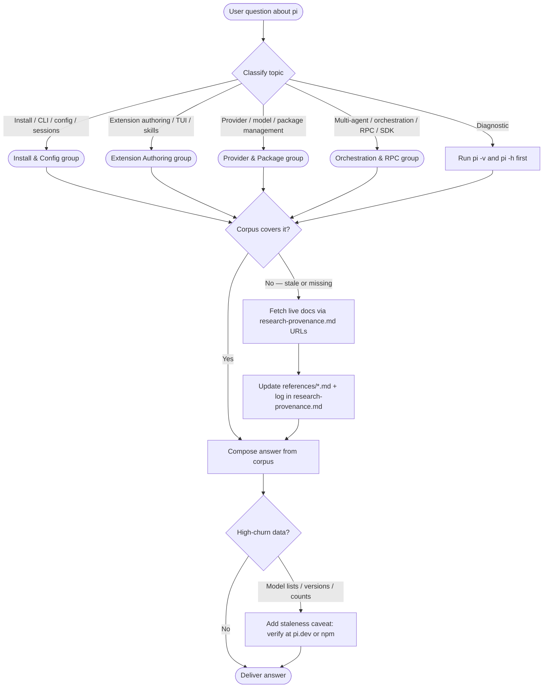
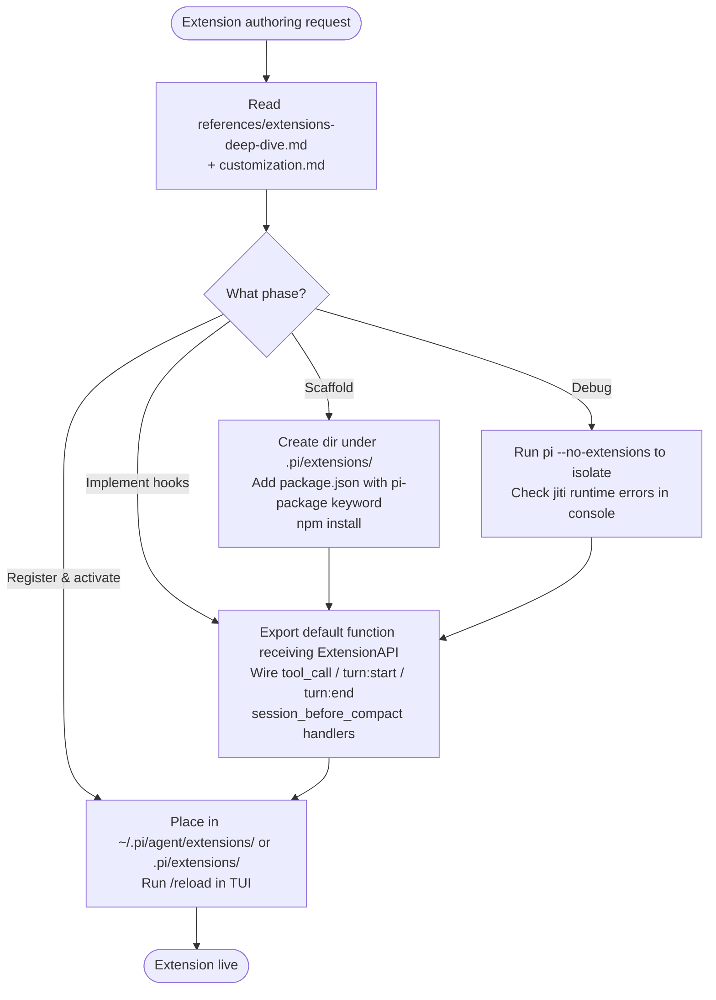
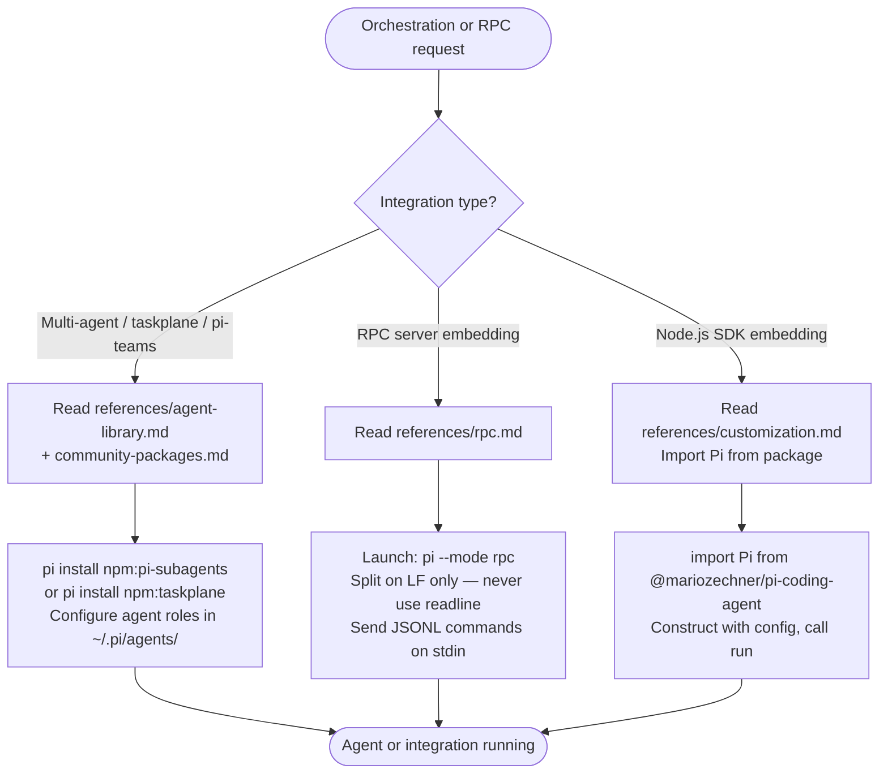
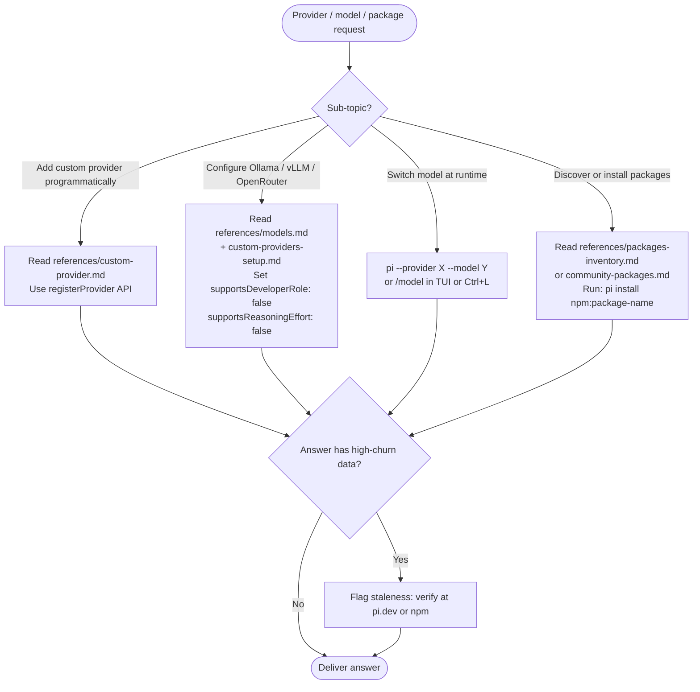

# pi
A documentation and guidance skill for **pi** (`@mariozechner/pi-coding-agent`) — a minimal, terminal-based coding agent built for maximum extensibility. Unlike Claude Code or Codex, pi deliberately omits opinionated features (sub-agents, plan mode, MCP, permission popups) and instead exposes primitives for building them yourself or installing community packages. The skill bundles a 17-file reference corpus captured on 2026-03-24 covering installation, CLI flags, extension authoring, custom model providers, RPC/SDK integration, multi-agent orchestration, session branching, and package discovery.

## Install

The fastest cross-agent install path is the `skills` CLI:

```bash
npx skills add gg-skills/pi
```

Drop this skill into a workspace as a Git submodule for pinned versions, or as a plain clone for latest `main`:

```bash
# Project-local, version-pinned:
git submodule add git@github.com:gg-skills/pi.git .claude/skills/pi

# OR project-local, latest main:
mkdir -p .claude/skills
git -C .claude/skills clone git@github.com:gg-skills/pi.git

# OR user-level, available in every project on this machine:
mkdir -p ~/.claude/skills
git -C ~/.claude/skills clone git@github.com:gg-skills/pi.git
```

Restart your agent or reload skills after installation. See the parent [`skills` catalog repo](https://github.com/gg-skills/skills) for the full catalog.

## When to use

- The user asks about `pi` CLI commands, flags, or configuration
- Working with pi extensions, skills, prompts, themes, or packages
- Customizing models, providers, or model proxies (Ollama, vLLM, OpenRouter)
- Building or debugging a pi extension (TypeScript, ExtensionAPI)
- Integrating pi via RPC or SDK in another application
- Setting up multi-agent orchestration with pi-subagents, taskplane, or pi-teams

## How it operates

### Inputs

The skill reads from a fixed local corpus (`references/`) and accepts user context covering:

| Input | Source | Example |
|-------|--------|---------|
| **pi config** | `~/.pi/agent/settings.json` or `.pi/settings.json` | `enabledModels`, `enableInstallTelemetry`, `PI_CACHE_RETENTION` |
| **Custom providers** | `~/.pi/agent/models.json` | An Ollama entry with `baseUrl: "http://localhost:11434"`, `api: "ollama"`, `supportsDeveloperRole: false`, `supportsReasoningEffort: false` |
| **Model selection** | CLI flag or `/model` TUI command | `pi --provider ollama --model llama3.1:8b` or `Ctrl+L` during session |
| **Packages** | `pi install <package>` commands | `pi install npm:pi-subagents`, `pi install npm:pi-mcp-adapter` |
| **Extension directories** | `~/.pi/agent/extensions/` (global) or `.pi/extensions/` (project) | A TypeScript file loaded at runtime via `jiti`; `package.json` must include `"keywords": ["pi-package"]` |
| **Environment variables** | Shell env | `PI_CODING_AGENT_DIR`, `PI_OFFLINE=1`, `PI_SKIP_VERSION_CHECK=1`, `PI_TELEMETRY=0` |

### Outputs

| Output | How it surfaces |
|--------|----------------|
| **CLI commands** | Exact flags and env-var invocations the user can run directly — never reconstructed from memory, always sourced from `references/installation-setup.md` or `references/quick-reference.md` |
| **Extension code** | TypeScript snippets implementing `ExtensionAPI` hooks (`tool_call`, `turn:start`, `turn:end`, `session_before_compact`), drawn from `references/extensions-deep-dive.md` |
| **Multi-agent orchestration plans** | Instructions for wiring `pi-subagents`, `taskplane`, or `pi-teams` packages, sourced from `references/agent-library.md` and `references/community-packages.md` |
| **RPC integration guidance** | LF-delimited JSONL protocol details, example client code (Node.js, Python), and warning to avoid `readline` — sourced from `references/rpc.md` |
| **Provider registration snippets** | `registerProvider` calls for OAuth, streaming, per-model overrides — sourced from `references/custom-provider.md` |

### External commands

The skill advises on — but does not execute — the following pi CLI calls:

```bash
npm install -g @mariozechner/pi-coding-agent   # global install, Node.js v20+ required
pi -c                                           # continue last session
pi -p "prompt"                                  # non-interactive / print mode
pi --mode json -p "prompt"                      # stream events as JSONL
pi --mode rpc                                   # expose full RPC server on stdout
pi --tools read,grep,find,ls -p "prompt"        # restrict to read-only tools
pi --no-extensions                              # disable extensions for debugging
pi --provider ollama --model llama3.1:8b        # custom local model
pi install npm:pi-subagents                     # install a community package
pi -v                                           # version / diagnostics
pi -h                                           # full help
```

### Side effects

- **Session persistence:** pi auto-saves every session as a JSONL tree under `~/.pi/agent/sessions/` (or `PI_CODING_AGENT_DIR`). Use `--no-session` for ephemeral runs. Sessions can be branched with `/fork` and `/clone`.
- **Startup network call:** pi contacts `pi.dev` at startup to check for updates. Suppress with `PI_SKIP_VERSION_CHECK=1` or `PI_OFFLINE=1`.
- **Install telemetry:** pi sends an anonymous version ping on first install. Opt out with `PI_TELEMETRY=0` or `enableInstallTelemetry: false` in `settings.json`.
- **Extension hot-reload:** `/reload` in the TUI re-reads extension files from disk without restarting pi.
- **Prompt cache:** `PI_CACHE_RETENTION=long` extends the API-side prompt cache window, reducing cost for long sessions.

### Mode toggles

| Mode | Flag | Best for |
|------|------|----------|
| Interactive TUI | *(default)* | Exploration, coding sessions |
| Print / one-shot | `pi -p "prompt"` | Shell scripts, CI |
| JSON streaming | `pi --mode json -p "prompt"` | Structured automation |
| RPC server | `pi --mode rpc` | Python/non-Node.js embedding |
| SDK | `import { Pi } from '@mariozechner/pi-coding-agent'` | Node.js embedding |

## Operational flow

### Topic routing

Routes an incoming pi question to the correct thematic group and checks whether the local corpus is sufficient or live docs are needed.



### Extension authoring flow

Covers the lifecycle of building, registering, and iterating on a pi extension — from scaffold to hot-reload.



### Multi-agent orchestration & RPC

Covers wiring pi as a sub-agent, setting up orchestration packages, and embedding pi via RPC or SDK in external processes.



### Provider, model & package management

Covers configuring custom model providers, managing models.json, and installing or discovering community packages.



## Layout

```
.
├── SKILL.md                   ← entry point: overview, quick commands, workflow routing, policy
├── agents/
│   └── openai.yaml            ← IDE / agent descriptor
├── references/                ← 17 flat Markdown files; load only the subset the task needs
│   ├── overview.md            ← what pi is, philosophy, features, four operating modes
│   ├── installation-setup.md  ← install, CLI flags, env vars, keyboard shortcuts, TUI commands
│   ├── quick-reference.md     ← most-used flags, Extension API methods, RPC commands at a glance
│   ├── customization.md       ← extensions, skills, prompts, themes, pi packages, SDK, RPC overview
│   ├── extensions-deep-dive.md ← Extension API surface + 10 official example patterns
│   ├── custom-provider.md     ← programmatic provider extension via registerProvider API
│   ├── models.md              ← models.json schema + project vs global settings management
│   ├── custom-providers-setup.md ← step-by-step setup for kimi, minimax, nvidia providers
│   ├── rpc.md                 ← full RPC protocol: commands, events, types, example clients
│   ├── sessions-branching.md  ← JSONL tree format, /tree, /fork, /clone, compaction
│   ├── tui-components.md      ← Component interface, overlays, built-ins, keyboard, theming
│   ├── settings-reference.md  ← complete settings.json reference
│   ├── packages-inventory.md  ← 832 community packages categorized by type
│   ├── community-packages.md  ← detailed docs for top 8 community packages
│   ├── agent-library.md       ← 9 ready-to-use agent configurations with package lists
│   ├── research-provenance.md ← capture date, canonical source URLs, update history
│   └── refresh-documentation.md ← how to refresh this skill's docs corpus
└── assets/                    ← skill icons
```

## Quick start

Read [`SKILL.md`](./SKILL.md) first — it has a Quick Commands table for the most common invocations, a workflow routing table (task type → which reference files to load), a Command Decision Guide (interactive vs. print/JSON vs. RPC vs. SDK), a common-pitfalls list, and a full troubleshooting table.

Install pi globally before any other step:

```bash
npm install -g @mariozechner/pi-coding-agent   # requires Node.js v20+
```

Config directory: `~/.pi/agent/` (override via `PI_CODING_AGENT_DIR`). Project-level config lives in `.pi/`.

For routine CLI lookups use `references/quick-reference.md`. For extension authoring use `references/extensions-deep-dive.md`. For RPC integration use `references/rpc.md`. Never reconstruct CLI flags from memory — always read the relevant reference file first.

## Resources

- [SKILL.md](SKILL.md) — entry point with quick commands, routing table, pitfalls, and policy
- [agents/openai.yaml](agents/openai.yaml) — agent / IDE descriptor
- [references/](references/) — 17 flat Markdown files covering all pi topics
- [assets/](assets/) — skill icons

## Caveats

- **Pi deliberately lacks MCP, sub-agents, and permission popups.** These are not bugs. Use `pi-mcp-adapter` or a custom extension to add MCP support; use `npm:pi-subagents` for sub-agent delegation. See `references/community-packages.md`.
- **RPC framing is strict LF-delimited JSONL — never use Node `readline`.** Node `readline` splits on Unicode line separators that are valid inside JSON strings. Implement a manual `\n` splitter instead. See `references/rpc.md`.
- **Extensions are TypeScript loaded at runtime via jiti — no build step needed.** Place the extension directory under `~/.pi/agent/extensions/` or `.pi/extensions/` and ensure `package.json` has `"keywords": ["pi-package"]`. Run `npm install` in the extension directory for its dependencies.
- **Local model `compat` flags are required.** Ollama and vLLM often fail on `developer` role or `reasoning_effort`. Set `supportsDeveloperRole: false` and `supportsReasoningEffort: false` in `models.json`. See `references/models.md`.
- **Snapshot age: 2026-03-24.** Model lists, package download counts, and version numbers change frequently. Treat bundled data as likely stale for these topics and verify with `pi.dev` or `github.com/badlogic/pi-mono` before stating specifics.
